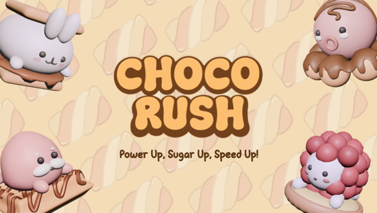
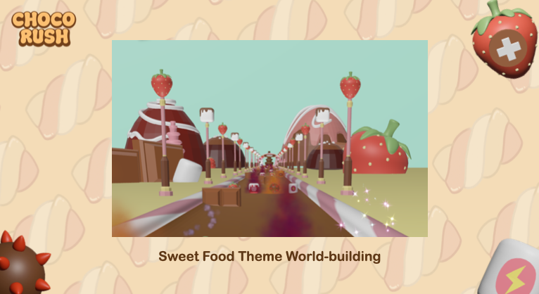
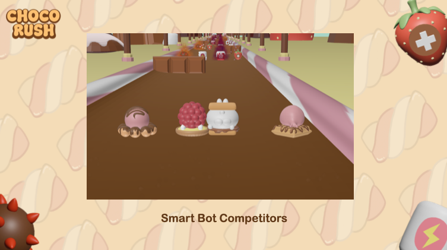
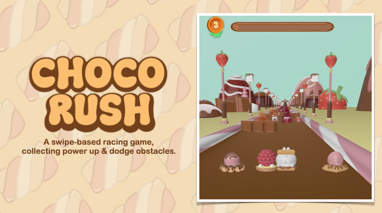

# Choco Rush
### A 3D Hypercasual Racing Game Experience

**SwiftUI • RealityKit • Reality Composer Pro – 2025**

---

## 🎮 Main Preview

---

## 📱 Gameplay Overview

Choco Rush is a fast-paced 3D racing game built entirely within the Apple ecosystem. Experience engaging hypercasual gameplay where you control your character with simple swipe mechanics to navigate through a magical chocolate-themed world, dodge obstacles, collect power-ups, and compete against intelligent bots.

### How to Play:
- **Swipe Left/Right** to move your character across lanes
- **Dodge Obstacles** that appear on the track
- **Collect Power-Ups** to gain competitive advantages
- **Race to the Finish** before your competitors

---

## 📸 Mobile Previews

### Preview 1: Character Selection

**Choose Your Racer:** Select from a variety of adorable chocolate-themed characters, each with unique personality and style. Customize your racing experience by picking your favorite sweet friend!

---

### Preview 2: Dynamic Racing Gameplay

**Race & Compete:** Navigate through thrilling tracks filled with obstacles and power-ups. Compete against smart bots that adapt to your performance, creating challenging and engaging races every time.

---

### Preview 3: Race Results & Leaderboard
**Earn Rewards:** Complete races to earn badges (1st, 2nd, 3rd, 4th place) and track your progress on the leaderboard. Master the tracks and become the ultimate racing champion!

---

## ✨ What Makes Choco Rush Unique

### 🍫 Sweet World Theme & World Building

Immerse yourself in a delightful chocolate-inspired universe. Every visual element, from character designs to track environments, is crafted with a sweet, whimsical aesthetic that creates a cohesive and enchanting gaming experience.

### 🤖 Smart Bot Competitions

Race against intelligent AI opponents that adapt to your playing style and skill level. The bots provide dynamic, competitive challenges that keep every race fresh and unpredictable, ensuring high replayability.

### 🎯 Swipe-Based Racing with Power-Ups & Obstacles

Simple yet strategic gameplay mechanics. Master the precision of swipe controls while managing power-ups (Speed Boost, Protection Shield) and dodging obstacles (Bombs, Slow-Down hazards) to maintain your lead and cross the finish line first.

---

## 🛠 Technical Implementation

### Architecture & Systems
- **Game Loop Logic:** Core game mechanics and real-time updates
- **Power-Up Systems:** Balanced power-up mechanics affecting gameplay
- **Bot AI:** Intelligent competitor pathfinding and decision-making
- **Asset Pipeline Optimization:** Seamless integration between Blender → Reality Composer Pro → RealityKit

### Performance
Optimized 3D asset pipelines for efficient performance across iOS devices, leveraging RealityKit for smooth visuals and responsive gameplay without compromising quality.

### Tech Stack
- **SwiftUI** - Modern UI framework for responsive interfaces
- **RealityKit** - 3D rendering and physics simulation
- **Reality Composer Pro** - 3D asset composition and animation
- **Swift** - Core game logic and systems

---

## 🎮 Genre Classification

**Hypercasual Game** - Choco Rush is designed as a hypercasual experience with:
- Simple, intuitive one-touch (swipe) controls
- Quick play sessions (ideal for mobile gaming)
- Highly engaging mechanics that are easy to learn but challenging to master
- Appealing visual design that attracts broad audiences
- Low barrier to entry with addictive progression

Perfect for casual gaming sessions while delivering enough depth to keep players engaged long-term.

---

## 👨‍💼 Tech Lead Development

**Key Responsibilities:**
- Implemented game loop logic, power-up systems, and bot AI for dynamic competition
- Optimized 3D asset pipelines between Blender, Reality Composer Pro, and RealityKit for efficient performance across iOS devices
- Designed and engineered core gameplay mechanics
- Ensured smooth performance and responsive user experience

---

## 📝 License

Copyright © 2025 Choco Rush. All rights reserved.

---

**Built with ❤️ using Apple's cutting-edge technology stack**
